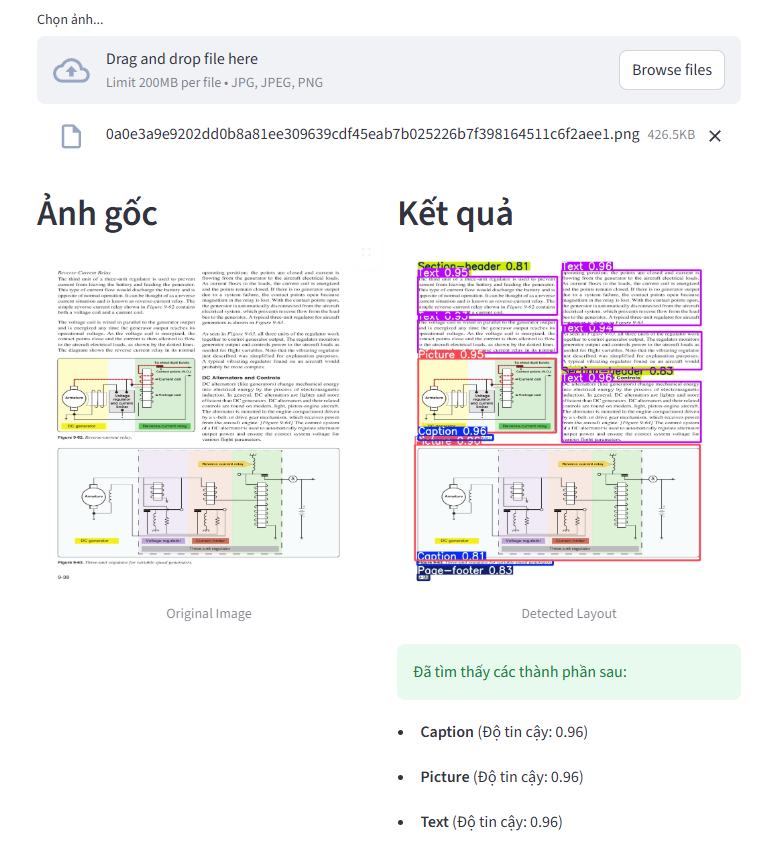

# 📄 Document Layout Analysis with YOLOv8 & Streamlit


## 🌟 Introduction
This project is an **End-to-End AI Application** designed to automatically analyze and detect document layout structures. 

Built with **YOLOv8** (fine-tuned on the **DocLayNet** dataset) and **Streamlit**, the application allows users to upload document images and instantly identify 11 distinct layout elements such as Headers, Footers, Tables, and Figures.

The system is deployed and accessible via the web, featuring a user-friendly interface with multi-language support.

## 🚀 Live Demo
You can try the application directly here:
👉 **[CLICK HERE TO VIEW DEMO](https://doc-layout-demo-xxx.streamlit.app)**

*(Note: Replace the link above with your actual Streamlit Cloud link)*

## ✨ Key Features
* **Object Detection:** Detects 11 document layout classes: `Caption`, `Footnote`, `Formula`, `List-item`, `Page-footer`, `Page-header`, `Picture`, `Section-header`, `Table`, `Text`, `Title`.
* **Interactive Interface:** Drag-and-drop image upload using Streamlit.
* **Result Visualization:** Draws bounding boxes with confidence scores.
* **Export Feature:** Download the processed image with detected layouts directly.
* **Statistics:** Displays a summary count of detected elements.

## 🛠️ Tech Stack
* **Core AI:** Python, Ultralytics YOLOv8 (Computer Vision).
* **Web Framework:** Streamlit.
* **Image Processing:** OpenCV, PIL (Pillow), NumPy.
* **Deployment:** Streamlit Community Cloud.

## 📸 Screenshots

*(Place a screenshot of your app here to impress recruiters. Example format below:)*



> *Figure 1: The application interface detecting layout elements from a document.*

## ⚙️ Installation & Usage (Local)

If you want to run this project on your local machine, follow these steps:

### 1. Clone the repository
```bash
git clone [https://github.com/zKdKaidO/DOD2.git](https://github.com/zKdKaidO/DOD2.git)
cd YourRepoName